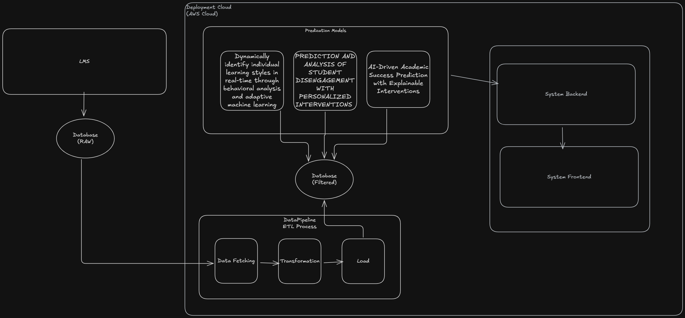

# EduMind - AI-Powered Educational Platform

A modern, scalable educational platform built with microservices architecture and a Turborepo monorepo setup.

## Project Structure

```
EduMind/
├── apps/
│   └── web/                    # Frontend React application
├── packages/
│   ├── tsconfig/              # Shared TypeScript configurations
│   └── utils/                 # Shared utility functions
├── backend/
│   └── services/              # Microservices
│       ├── user-service/      # User authentication & management
│       ├── course-service/    # Course management
│       ├── assessment-service/ # Assessment & quizzes
│       ├── service-xai-prediction/ # XAI predictions
│       ├── service-learning-style/ # Learning style detection
│       └── service-engagement-tracker/ # Engagement tracking
├── ml/                        # Machine learning models & pipelines
├── platform/                  # Infrastructure & Kubernetes configs
└── turbo.json                # Turborepo configuration
```

## System Architecture



## Tech Stack

### Frontend
- **Framework**: React 19 + TypeScript
- **Build Tool**: Vite 7
- **Styling**: Material-UI (to be configured)
- **State Management**: Redux

### Backend
- **Framework**: FastAPI 0.104.1
- **Language**: Python 3.11
- **Database**: PostgreSQL + TimescaleDB
- **Message Queue**: RabbitMQ
- **Cache**: Redis

### Infrastructure
- **Cloud**: Google Cloud Platform (GKE)
- **Container**: Docker + Kubernetes
- **IaC**: Terraform
- **CI/CD**: GitHub Actions
- **Monitoring**: Grafana + Loki + Tempo

### Monorepo
- **Tool**: Turborepo 1.10.16
- **Package Manager**: pnpm 8.10.0

## Prerequisites

- Node.js >= 18.0.0
- pnpm >= 8.0.0
- Python >= 3.11
- Docker & Docker Compose
- kubectl (for Kubernetes)
- Terraform (for infrastructure)

## Getting Started

### 1. Install Dependencies

```bash
# Install pnpm globally if not installed
npm install -g pnpm@8.10.0

# Install all dependencies for the entire monorepo
pnpm install
```

### 2. Environment Setup

```bash
# Copy environment templates
cp backend/.env.example backend/.env
cp apps/web/.env.example apps/web/.env

# Edit the .env files with your configuration
```

### 3. Development

#### Run All Services

```bash
# Start all apps and services in development mode
pnpm dev
```

#### Run Specific Service

```bash
# Frontend only
pnpm --filter @edumind/web dev

# Specific backend service
cd backend/services/user-service
python -m venv venv
source venv/bin/activate  # On Windows: venv\Scripts\activate
pip install -r requirements.txt
pnpm dev
```

#### Using Docker Compose

```bash
# Start all backend services
cd backend
docker-compose up -d

# View logs
docker-compose logs -f

# Stop services
docker-compose down
```

### 4. Building

```bash
# Build all apps and packages
pnpm build

# Build specific app
pnpm --filter @edumind/web build
```

### 5. Testing

```bash
# Run all tests
pnpm test

# Run tests with coverage
pnpm test:cov

# Frontend tests only
pnpm --filter @edumind/web test
```

### 6. Linting & Formatting

```bash
# Lint all code
pnpm lint

# Type checking
pnpm type-check

# Format Python code
cd backend/services/user-service
pnpm format
```

## Turborepo Commands

```bash
# Run tasks across all workspaces
turbo run build
turbo run test
turbo run lint

# Run with caching
turbo run build --cache-dir=".turbo"

# Clear cache
turbo run clean
```

## Service Ports

- **Frontend**: http://localhost:5173
- **User Service**: http://localhost:8001
- **Course Service**: http://localhost:8002
- **Assessment Service**: http://localhost:8003
- **XAI Prediction Service**: http://localhost:8004
- **Learning Style Service**: http://localhost:8005
- **Engagement Tracker Service**: http://localhost:8006

## API Documentation

Once services are running, access Swagger UI:
- User Service: http://localhost:8001/docs
- Course Service: http://localhost:8002/docs
- Assessment Service: http://localhost:8003/docs
- XAI Prediction Service: http://localhost:8004/docs
- Learning Style Service: http://localhost:8005/docs
- Engagement Tracker Service: http://localhost:8006/docs

## Deployment

### Local Kubernetes (Minikube)

```bash
# Start minikube
minikube start

# Build images
cd backend
docker-compose build

# Deploy to Kubernetes
kubectl apply -f platform/kubernetes/services/templates/
```

### Google Kubernetes Engine (GKE)

```bash
# Setup infrastructure with Terraform
cd platform/infrastructure/gke
terraform init
terraform plan
terraform apply

# Deploy with Helm
cd platform/kubernetes/services
helm install edumind . -f values.yaml
```

## CI/CD

The project uses GitHub Actions for continuous integration and deployment:

- **CI Pipeline** (.github/workflows/ci-app.yml):
  - Linting (Python & TypeScript)
  - Unit tests
  - Integration tests
  - Docker image builds

- **CD Pipeline** (.github/workflows/cd-app.yml):
  - Staging deployment
  - E2E tests
  - Production deployment
  - Database migrations

- **ML Pipeline** (.github/workflows/ml-pipeline.yml):
  - Model training
  - Model validation
  - Model deployment to Vertex AI

## Contributing

1. Create a feature branch: `git checkout -b feature/your-feature`
2. Make your changes
3. Run tests: `pnpm test`
4. Run linting: `pnpm lint`
5. Commit your changes: `git commit -m "Add your feature"`
6. Push to the branch: `git push origin feature/your-feature`
7. Create a Pull Request

## Project Documentation

- [Backend README](./backend/README.md)
- [Frontend README](./apps/web/README.md)
- [Infrastructure Guide](./platform/infrastructure/README.md)
- [ML Pipeline](./ml/README.md)
- [Project TODO](./todo/PROJECT_TODO.md)

## License

MIT License - See LICENSE file for details

## Support

For issues and questions:
- Create an issue in the GitHub repository
- Contact the development team

## Roadmap

See [PROJECT_TODO.md](./todo/PROJECT_TODO.md) for the detailed 12-week development roadmap.
